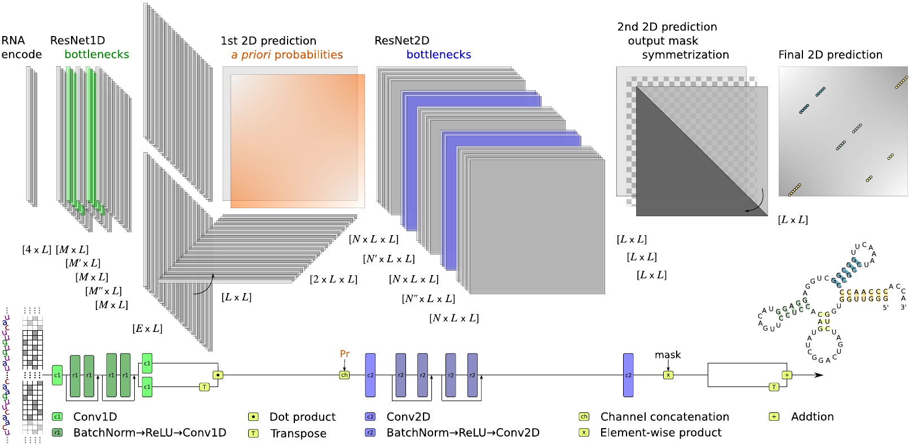

# **sincFold**

This is the repository for sincFold, a new RNA folding prediction tool based on deep learning.


<p align="center">

</p>

```bibtex
@article{sincFold2023,
  title={sincFold: end-to-end learning of short- and long-range interactions for RNA folding},
  author={Leandro A. Bugnon and Leandro Di Persia and Matias Gerard and Jonathan Raad and Santiago Prochetto and Emilio Fenoy and Uciel Chorostecki and Federico Ariel and Georgina Stegmayer and Diego H. Milone},
  journal={under review},
  year={2023}
}
```

sincFold is a fast and accurate RNA secondary structure prediction method. It is an end-to-end approach that predicts the contact matrix using only the sequence of nucleotides as input. The model is based on a residual neural network that can learn short and long context interactions. Extensive experiments on several benchmark datasets were made, comparing sincFold against classical methods and new models based on deep learning. We demonstrate that sincFold achieves the best performance in comparison with state-of-the-art methods.

A summary of results can be seen in [this notebook](results/summary.ipynb).

## Folding RNA sequences

We have a [webserver](https://sinc.unl.edu.ar/web-demo/sincfold/) running with the latest version. This server admits one sequence at a time. We provide a model pre-trained with validated RNA datasets (ArchiveII, RNAstralign, URS-PDB). Please follow the next instructions if you want to run the model locally.


## Install

This is a Python package. It is recommended to use virtualenv or conda to create a new environment. To install the package, run:

    pip install sincfold

Alternativelly, you can clone the repository with:

    git clone https://github.com/sinc-lab/sincFold
    cd sincFold/

and install with:

    pip install .

## Predicting sequences

To predict the secondary structure of a list of sequences, using the pretrained weights, use
    
    sincFold pred GUAGUCGUGGCCGAGUGGUUAAGGCGAUGGACUAGAAAUCCAUUGGGGUCUCCCCGCGCAGGUUCGAAUCCUGCCGACUACGCCA

This will display the predicted dotbracket structure in the console. sincFold supports files in .csv and .fasta format as inputs, and fasta or CT as outputs.

    sincFold pred sample/test.fasta -o pred_ct_files/

## Training and testing models

A new model can be trained using  
    
    sincFold train sample/train.csv -n 10 -o output_path

The option -n limits the maximum number of epochs to get a quick result. 

Then, a different test set can be evaluated with 

    sincFold test sample/test.csv -w output_path/weights.pmt

The model path (-w) is optional, if ommited the pretrained weights are used.

## Reproducing our results

You can run the complete train and test scheme using the following code (in this case set up benchmarkII and fold 0 data partition). 

```python
import os 
import pandas as pd 

out_path = f"working_path/"
os.mkdir(out_path)

# read dataset and predefined partitions
dataset = pd.read_csv("data/benchmarkII.csv", index_col="id")
partitions = pd.read_csv("data/benchmarkII_splits.csv")

dataset.loc[partitions[(partitions.fold_number==0) & (partitions.partition=="train")].id].to_csv(out_path + "train.csv")
dataset.loc[partitions[(partitions.fold_number==0) & (partitions.partition=="valid")].id].to_csv(out_path + "valid.csv")
dataset.loc[partitions[(partitions.fold_number==0) & (partitions.partition=="test")].id].to_csv(out_path + "test.csv")
```

then call the training and testing functions


    sincFold -d cuda train working_path/train.csv --valid_file working_path/valid.csv -o working_path/output/

    sincFold -d cuda test working_path/test.csv -w working_path/output/weights.pmt

Using a GPU for training is recommended (with the option '-d cuda'). The complete process may take about 3hs using a RTX A5000.